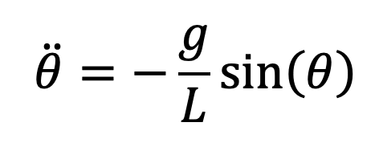
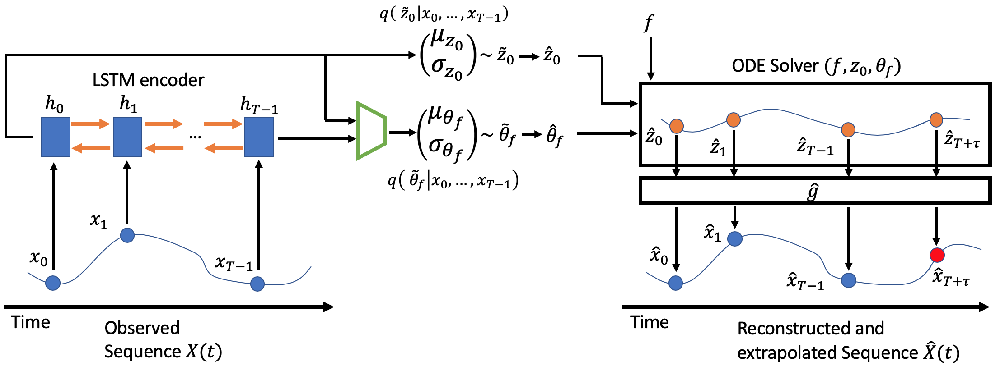

<script id="MathJax-script" async src="https://cdn.jsdelivr.net/npm/mathjax@3/es5/tex-mml-chtml.js"></script>

This blog was written by Ori Linial, as a supplement for the paper published on ACM Conference on Health, Inference, and Learning (ACM-CHIL). [Link to paper](https://arxiv.org/abs/2003.10775). 
<br>
<br>

### Why Use Mechanistic Knowledge?
Imagine you are presented a sequence of frames:

<video src="pendulum.mp4" poster="poster.jpg" width="320" height="200" autoplay muted loop preload=auto></video>

Your task is to predict this video's future frames. Normally extrpolating signals is a very hard task in machine learning, studied in many other papers in recent years.
<br>
Howdver, when humans observe this video, we could predict it's behaviour rather easily. 
Why is that? what do we utilize when we see this type of behaviour?
The same thing happens when we see a ball rolling down the hill. We have some knowlege about the physical mechanism we observe. This knowldge could come in many ways, but in this paper we choose to focus on knowlenge in the form of an ODE system.
<br>
<br>
The system in the video above, is a standard friction-less pendulum. This system has been studied for hundreds of years, and a very simple ODE formulation has been created to model this phenomenon:

$$ \ddot{theta} = -\frac{g}{L} sin(\theta) $$
<!--  -->

Where __ is the pendulum's angle, _L_ is the pendulum's length, and _g_ is the gravity constant. An important notion is that we are observing a video of a pendulum, but we are given an ODE system for the angle. In fact, we do not know the complex and highly non-linear transformation between the pendulum's angle and the observed frame.
<br>
<br>
Observing the ODE, introduces us with a new unknown variable - the pendulum's angle. The angle is a parameter of the ODE system, it could be different if we are given a new video of another pendulum, but we know for certain that this parameter remains constant over time. <br>
Therefore an interesting additional task is born: given a video, could we somehow predict it's length?
<br>
<br>
We use the notation of _known-unknowns_ to describe the ODE variables and static parameters (static in the sense of not changing over time). We know that these variables are a part of the ODE system, but we don't know their value. Hence they are _known-unknowns_.
<br>
<br>
To sum up, we are given a video, and an ODE form and we are interested in the following questions:
- Would the known ODE form help us in our efforts to predict the given video?
- Could we somehow predict the ODE static parameters?
- What else could be benefited from the added mechanistic knowldge? Maybe train-set size reduction?

### Nice, but is there a more realistic scenario?
Videos of pendulums are a very good way to understand what benefits could be achieved when utilizing ODE systems for sequence modeling tasks.
However, modern ML methods aim to predict signals in much harder scenarious, where there are no physical mechanistic knowledge present. <br>
So, is there a more realistic scenario, where an ODE system **is** present?
<br>
<br>
The motivation behind our paper lies in healthcare. ICU (intensive care units) doctors take measurements from patients like temperature, blood pressure, ECG signals etc. and try to select the best treatment available. Modern machine learning methods could be used to predict the patient state for different doctor actions, and select the one with the desired outcome. However, these methods ability to extrapolate given signals is very limited, and in addition -- doctors could not understand why the method predict one outcome over the other.
<br>
<br>
Over the years there has been a great interest in modeling the cardiovascular system in an ODE form. one such model is the one proposed by [zenker et al (2007)](https://journals.plos.org/ploscompbiol/article?id=10.1371/journal.pcbi.0030204). This ODE system, has many variables and static parameters, which are very difficult or impossible to measure. 
<br>
<br>
Connecting the dots: **would the immense work done on modelling the cardiovascular system as an ODE, enable better predictions for patient states?**

## GOKU-net
We present a generative approach based on a varioational-autoencoder, called GOKU-Net. <br>
In our scenario, we are given two things:
1. Observed signals (e.g., videos of pendulums).
2. ODE functional form.
We don't know the transformation between the observations to the ODE variables, and do not know the ODE static parameters.
<br>
<br>

To this end, we created the generative architecture capable of utilizing the ODE form. 
This architecture is comprised of two parts: (1) an inference model (encoder), and (2) a generative model (decoder).
The inference model consumes the observed signal, and aims to infer the ODE's static parameters, and a ODE variable at t=0 (namely, ODE's initial value):



This 


### Markdown

Markdown is a lightweight and easy-to-use syntax for styling your writing. It includes conventions for

```markdown
Syntax highlighted code block

# Header 1
## Header 2
### Header 3

- Bulleted
- List

1. Numbered
2. List

**Bold** and _Italic_ and `Code` text

[Link](url) and 
```

For more details see [GitHub Flavored Markdown](https://guides.github.com/features/mastering-markdown/).

### Jekyll Themes

Your Pages site will use the layout and styles from the Jekyll theme you have selected in your [repository settings](https://github.com/orilinial/GOKU/settings). The name of this theme is saved in the Jekyll `_config.yml` configuration file.

### Support or Contact

Having trouble with Pages? Check out our [documentation](https://docs.github.com/categories/github-pages-basics/) or [contact support](https://support.github.com/contact) and we’ll help you sort it out.
