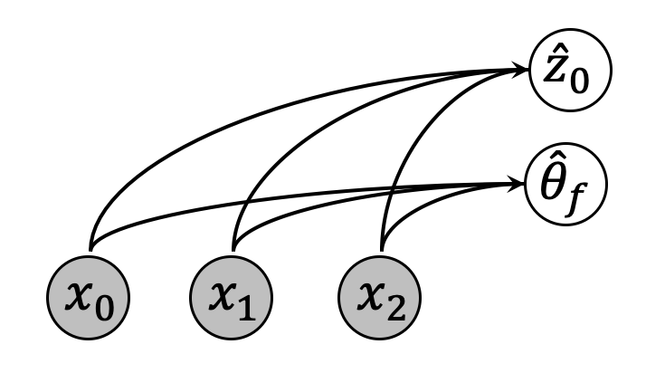
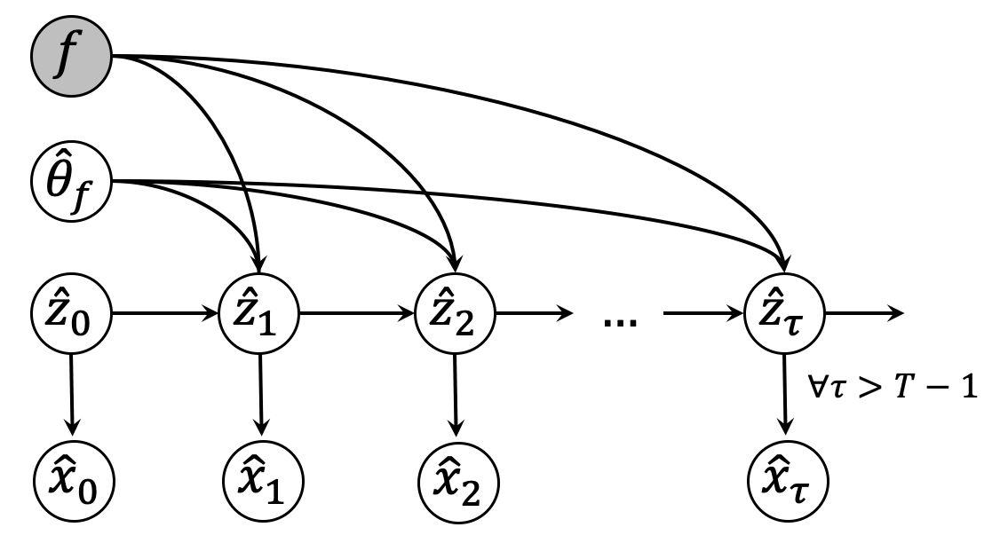

This blog accompanies the GOKU-net paper published on ACM Conference on Health, Inference, and Learning (ACM-CHIL). The paper was written by Ori Linial, Neta Ravid, Danny Eitan and Uri Shalit, [Link to paper](https://arxiv.org/abs/2003.10775). 
 
 

### Why Use Mechanistic Knowledge?
Imagine you are presented a sequence of frames:

<video src="pendulum.mp4" poster="poster.jpg" width="320" height="200" autoplay muted loop preload=auto></video>

Your task is to predict this video's future frames. Normally extrpolating signals is a very hard task in machine learning, studied in many other papers in recent years.
 
However, when humans observe this video, we could predict it's behaviour rather easily. 
Why is that? what do we utilize when we see this type of behaviour?
The same thing happens when we see a ball rolling down the hill. We have some knowlege about the physical mechanism we observe. This knowldge could come in many ways, but in this paper we choose to focus on knowlenge in the form of an ODE system.
 
 
The system in the video above, is a standard friction-less pendulum. This system has been studied for hundreds of years, and a very simple ODE formulation has been created to model this phenomenon:

$$ \ddot{\theta} = -\frac{g}{L} sin(\theta) $$

Where $$\theta$$ is the pendulum's angle, $$L$$ is the pendulum's length, and $$g$$ is the gravity constant. An important notion is that we are observing a video of a pendulum, but we are given an ODE system for the angle. In fact, we do not know the complex and highly non-linear transformation between the pendulum's angle and the observed frame.
 
 
Observing the ODE, introduces us with a new unknown variable - the pendulum's angle. The angle is a parameter of the ODE system, it could be different if we are given a new video of another pendulum, but we know for certain that this parameter remains constant over time.  
Therefore an interesting additional task is born: given a video, could we somehow predict it's length?
 
 
We use the notation of _known-unknowns_ to describe the ODE variables and static parameters (static in the sense of not changing over time). We know that these variables are a part of the ODE system, but we don't know their value. Hence they are _known-unknowns_.
 
 
To sum up, we are given a video, and an ODE form and we are interested in the following questions:
- Would the known ODE form help us in our efforts to predict the given video?
- Could we somehow predict the ODE static parameters?
- What else could be benefited from the added mechanistic knowldge? Maybe train-set size reduction?

### Nice, but is there a more realistic scenario?
Videos of pendulums are a very good way to understand what benefits could be achieved when utilizing ODE systems for sequence modeling tasks.
However, modern ML methods aim to predict signals in much harder scenarious, where there are no physical mechanistic knowledge present.  
So, is there a more realistic scenario, where an ODE system **is** present?
 
 
The motivation behind our paper lies in healthcare. ICU (intensive care units) doctors take measurements from patients like temperature, blood pressure, ECG signals etc. and try to select the best treatment available. Modern machine learning methods could be used to predict the patient state for different doctor actions, and select the one with the desired outcome. However, these methods ability to extrapolate given signals is very limited, and in addition -- doctors could not understand why the method predict one outcome over the other.
 
 
Over the years there has been a great interest in modeling the cardiovascular system in an ODE form. one such model is the one proposed by [zenker et al (2007)](https://journals.plos.org/ploscompbiol/article?id=10.1371/journal.pcbi.0030204). This ODE system, has many variables and static parameters, which are very difficult or impossible to measure. 
 
 
Connecting the dots: **would the immense work done on modelling the cardiovascular system as an ODE, enable better predictions for patient states?**

## GOKU-net
We present a generative approach based on a varioational-autoencoder, called GOKU-Net.  
In our scenario, we are given two things:
1. Observed signals (e.g., videos of pendulums) **$$X$$**.
2. ODE functional form **$$f$$**.

We don't know the transformation between the observations **$$X$$** to the ODE variables **$$Z$$**, and do not know the ODE static parameters **$$\theta_f$$**.
 
 
To this end, we created the generative architecture capable of utilizing the ODE form. 
This architecture is comprised of two parts: (1) an inference model (encoder), and (2) a generative model (decoder).
The inference model consumes the observed signal, and aims to infer the ODE's static parameters **$$\theta_f$$**, and a ODE variable at $$t=0$$ (namely, ODE's initial value) **$$z_0$$**:

 
We next use the infered initial ODE value **$$z_0$$** and parameters **$$\theta_f$$**, combined with the ODE functional form **$$f$$** to create a trajectory of the latent signal **$$Z$$**. This is done by using an ODE solver (could be a simple euler-like ODE integrator, or a more advanced one as introducted by Chen et al (2018) in the [Neural ODE paper](https://arxiv.org/abs/1806.07366)).
 
The latent signal **$$Z$$** then serves as an input to a generative net **$$g$$** producing a reconstructed signal **$$\hat{X}$$**.
Using the ODE solver means that we could compute $$z_t$$ in any arbitarary time, specificaly far forward time which could be very beneficial in the healthcare scenario.

 
### The entire model
Until now, we only introduced the auto-encoder model, but where is the variational part? and why do we even need it to be variational?  
#### Why _variational_ autoencoder?
There are maby answers to _why_ variational autoencoder and not a simple autoencoder, as been studied over the last several years since the original variational autoencoder works introduced by [Rezendes et al (2014)](https://arxiv.org/abs/1401.4082), and [Kingma & Welling (2013)](https://arxiv.org/abs/1312.6114).
Variational-autoencoders are capable of learning the probability **$$p(X)$$** on the given signal space, by maximizing the $$ELBO$$ loss. It is also capable of learning the likelihood probability **$$p(X|Z)$$**, and learn an approximation of the posterior probability **$$q(Z|X)$$** (for more information I encourage the reader the read the VAE papers above, or [this](https://arxiv.org/abs/1606.05908) great tutorial).  
Using VAEs therefore gives us two important abilities:
1. We could sample $$p(Z)$$, and use the generative network to obtain new samples $$X$$, which follow the same distribution as the train set. This could be used in many cases, e.g., incorporating external actions in the latent space (someone pushes the pendulum in some direction, or infuses medicine to a pateint).
2. Given a new signal $$X$$, we could test if this signal is likely to have the same properties as our dataset by testing the posterior distribution.

#### Any caveats?
Standatd VAEs assume that the latent space $$Z$$ is abstract and does not have any physical meaning. Hence usually assumes a prior: $$z \sim N(0,I)$$, for making the $$ELBO$$ loss analyticaly solveable. In our case the latent space has a physical meaning! The pendulum length for example cannot be negative.  
This problem requires some workaround so that the latent space would still retain it's physical meaning. To this end, we introduced a new latent space comprised of **$$\tilde{z}_0$$** and **$$\tilde{\theta}_f$$**, both have the standard normal distribution prior. and added two NNs that transform the sampled $$\tilde{z}_0$$ and $$\tilde{\theta}_f$$ into $$z_0$$ and $$\theta_f$$. Meaning these NNs goal is to transform the standard normal distribution into the real distribution over latent space.

## Experiments
We tested GOKU on multiple domains agains various baselines.

### Experiment 1: Cardiovascular system
We start off with the experiment that motivated this work - the cardiovascular system.  
